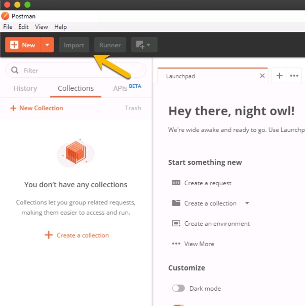
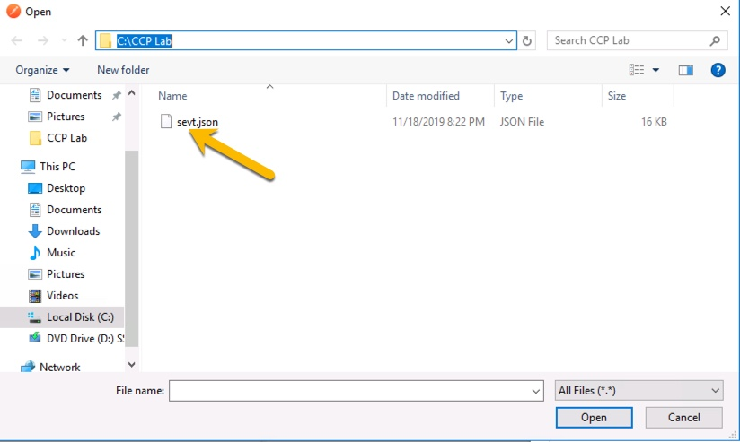
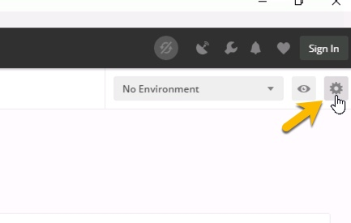
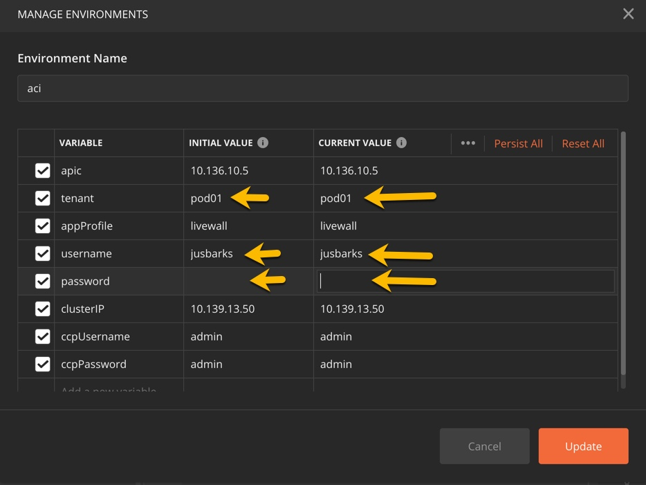

# Kubernetes, Hyperflex, ACI OH MY!

Table of Contents
=================

* [Preparation](#preparation)
	* [Logging In](#logging-in)
	* [Connecting to Remote Desktop](#connecting-to-remote-desktop)
	* [Postman Setup](#postman-setup)

## Preparation

Before we create our first CCP cluster we need to access the lab.  The lab leverages a Cisco Field Lab in the DMZ.  We will leverage the Cisco Anyconnect Client to access this lab

## Logging In

* Open your Cisco Anyconnect Client
	* Connect to vpn.reqdemo.com (your vpn may drop and reconnect after 1 minute.  This is normal)
	

## Connecting to Remote Desktop	

* Using your favorite remote desktop client RDP to:
	* req-rdp.csc.richfield.cisco.com
		* Login using the lab credentials provided
		* username: userXX
		* password: C1sco12345!
		* Close the Server Manager Screen If present
		
## Postman Setup 
	
	* Open the Postman App on the Desktop
	
	
	* In the upper left hand corner select "Import"
	
	* Select "Choose Files"
	
	* Browse to "C:\CCP Lab"
		* Select "sevt.json"
		* Select "Open"
	
	* The Collection of Postman Scripts is now under your "Collections" in Postman
	* In the upper righthand corner select the "Gear Icon"
	
	* Create a new Environment
		* Postman variables can be used by creating an environment where the variables and their values are defined.  Name the environment "CCP"
		* Add the variables as seen in the screenshot.
			* Note in the "tenant" variable put your "pod value there"
			* replace the username and password with the values you have been given
		
		* Select "Add" when completed.
		* 
	
	* We will use this later

